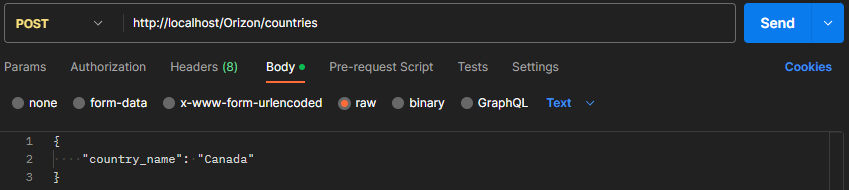
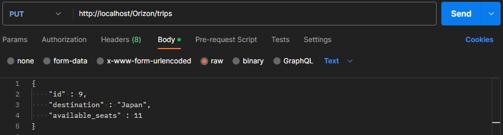

#  Progetto PHP e MySQL.

Questo progetto è stato sviluppato utilizzando PHP e MySQL con l'obiettivo di mettere in pratica ciò che ho appreso dalla guida di questi due linguaggi. L'obiettivo principale del progetto è di creare delle API JSON RESTful per promuovere le offerte di una ipotetica agenzia di viaggi che si concentra su viaggi sostenibili.

## API

Le API consentono l'inserimento, la modifica e la cancellazione di un paese che avrà una sola caratteristica: il nome. Consentono anche l'inserimento, la modifica e la cancellazione di un viaggio che ha come caratteristiche le destinazioni che coinvolgono il viaggio e il numero di posti disponibili. Infine, le API consentono la visualizzazione di tutti i viaggi filtrati per paesi e numero di posti disponibili.

# Setup

Per poter utilizzare le API fornite in questo progetto, è necessario eseguire alcuni passaggi di configurazione preliminari oltre alla ricostruzione del database. In particolare, è necessario installare le dipendenze necessarie e configurare le variabili d'ambiente nel file .env.

## Installazione delle dipendenze

Le dipendenze necessarie per far funzionare il progetto sono elencate nel file `composer.json`. Per installare tutte le dipendenze, eseguire il comando:

`composer install`

## Configurazione delle variabili d'ambiente

Prima di eseguire il progetto, assicurati di creare un file `.env` nella root del progetto e di configurare le seguenti variabili d'ambiente:

NAME=database_name

USERNAME=database_username

PASSWORD=database_password

CONNECTION=mysql

Si ricordi di sostituire i valori dei parametri sopra indicati con i valori corretti del database.    
Infine bisognerà ricostruire il database con il file `migrations.sql`.

## API

#### READ

Per iniziare possiamo controllare i dati all'interno delle tabelle utilizzando il metodo GET e uno dei seguenti URL:

`http://localhost/Orizon/country`  
`http://localhost/Orizon/trip`

Esempio

#### API Paesi

Per `inserire` un nuovo paese, utilizziamo il metodo POST con il seguente URL:

`http://localhost/Orizon/country` 

Con il seguente JSON nel corpo della richiesta:

{  
&nbsp;&nbsp;&nbsp;&nbsp;"country_name": "Canada"  
}

Per `modificare` il nome di un paese, utilizziamo il metodo PUT con il seguente URL:

`http://localhost/Orizon/country` 

Nel JSON inseriremo l'ID del paese che vogliamo modificare e il nuovo nome.

{  
&nbsp;&nbsp;&nbsp;&nbsp;"id" : ID,  
&nbsp;&nbsp;&nbsp;&nbsp;"country_name" : "nuovo nome"  
}

Per `eliminare` un paese dal database, utilizziamo il metodo DELETE con il seguente URL:

`http://localhost/Orizon/country/{id}` 

Dove {id] corrisponde all'ID del paese che vogliamo eliminare

#### API Viaggi

Per `inserire` un nuovo viaggio, utilizziamo il metodo POST con il seguente URL:

`http://localhost/Orizon/trip` 

Con il seguente JSON nel corpo della richiesta:

{  
&nbsp;&nbsp;&nbsp;&nbsp;"destination" : "Italia",  
&nbsp;&nbsp;&nbsp;&nbsp;"available_seats" : 5  
}

Per `modificare` un viaggio, utilizziamo il metodo PUT con il seguente URL:

`http://localhost/Orizon/trip` 

Nel JSON inseriremo l'ID del paese che vogliamo modificare, il nuovo nome o il nuovo numero di posti disponibili.

{  
&nbsp;&nbsp;&nbsp;&nbsp;"id" : 13,  
&nbsp;&nbsp;&nbsp;&nbsp;"destination" : "Italia",  
&nbsp;&nbsp;&nbsp;&nbsp;"available_seats" : 4  
}

Per `eliminare` un viaggio, dal database utilizziamo il metodo DELETE con il seguente URL:

`http://localhost/Orizon/trip/{id}` 

Dove {id] corrisponde all'ID del viaggio che vogliamo eliminare

Per `filtrare` i viaggi disponibili in base ai paesi e numero di posti disponibili, utilizziamo il metodo GET con il seguente URL:

`http://localhost/Orizon/filter`

## Extra

A fini didattici, ho sviluppato un'interfaccia utente che consente di provare le varie funzionalità dell'applicazione. L'applicazione è strutturata in modo semplice, con due moduli di inserimento dei dati nel database e tre colonne che mostrano tutte le informazioni salvate. Accanto a ciascuna riga, sono presenti dei pulsanti che consentono di interagire con gli elementi salvati. Una volta installata l'applicazione sarà possibile provarlo nel proprio localhost.

